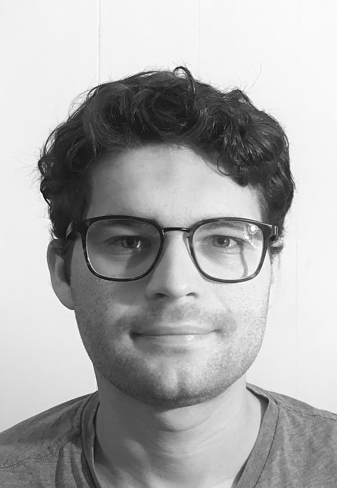

The Tenth Swedish Language Technology Conference (SLTC) will take place on **27th–29th of November 2024** at **Linköping University**, Sweden, with the main conference on Wednesday–Thursday 27th-28th of November and workshops on Friday, 29th of November. All researchers and students working on NLP and related fields are invited to participate. 

### Important Dates

* Workshop Proposal Submission Deadline: ~~23.8.~~
* Workshop Notification of Acceptance: ~~26.8.~~
* Extended Abstracts Submission Deadline: ~~15.9~~
* Extended Abstracts Notification of Acceptance: ~~14.10~~.
* Camera-Ready Abstracts: 1.11. 
* Conference: 27-28.11. 
* Workshops: 29.11.

### Registration

If you will participate, please register [here](https://www.trippus.net/sltc2024_delegate). 

### Program

The program will be published in the beginning of November. The main conference will start on the 27. at 13:00 and end on the 28. at 17:00. For workshop programs, we refer to their respective websites. 

### Workshops

SLTC 2024 traditionally hosts selected workshops on relevant topics. This year's workshops are: 

* [Computational Social Science and Language Technology](https://sites.google.com/view/css-language-tech-workshop)
* [Swedish Workshop on Conversational AI](https://sites.google.com/view/sw-conv-ai-2024/home)
* [Towards the Positronic Brain: Workshop on Embodied Language Processing and Multimodal Interaction](https://gu-clasp.github.io/language-and-perception/events/positronic-brain/)
* [Applications of Universal Dependencies](https://udapp-sltc-2024.github.io)

### Invited Speakers

We will have two keynotes by our exciting invited speakers: 

* **David Samuel** is a PhD student in the Language Technology Group at the University of Oslo. His team's submission won the CoNLL 2023 Shared Task on training a language model on a fixed data budget of 10 or 100 million tokens, known as the *BabyLM* challenge. 

Talk Abstract: *The BabyLM Challenge represents a unique opportunity in language model research: by limiting training data to just 10–100M words - comparable to what children encounter during language acquisition - it creates an accessible environment for exploring fundamental questions about language learning. Unlike typical language model research that requires massive computing resources and trillions of training tokens, BabyLM's constrained setting enables rapid experimentation and architectural innovation. We present our findings from multiple submissions to this challenge, including a novel GPT-BERT hybrid that combines masked and causal language modeling objectives, and an innovative layer-selective transformer that allows each layer to choose its inputs from previous layers. We also investigated latent bootstrapping as an alternative to traditional self-supervision. Our experiments demonstrate that architectural innovations can dramatically improve data efficiency, with our hybrid models and layer-selective transformers achieving strong performance on linguistic benchmarks despite using orders of magnitude less data than conventional language models. These results point to promising directions for developing more efficient language models while highlighting the value of constrained experimental settings in advancing our understanding of language learning.*

* **Tiago Pimentel** is a Postdoc at ETH Zürich and holds a PhD from the University of Cambridge. His work on information theory as a tool to understand linguistics and language models has been groundbreaking, with important applications such as probing representations for linguistic structure and improving sampling strategies in generative models.

### Call for Extended Abstracts

Papers are invited on all theoretical, practical and applied aspects of language technology, including natural language processing, computational linguistics, speech technology and neighbouring areas. Papers can describe completed or ongoing research, as well as practical applications of language technology, and may be combined with system demonstrations. [More Information](cfp).

The conference does not publish any proceedings but accepted contributions will be made available on the conference web page as extended abstracts. Hence, it is possible to submit abstracts related to work that has been, or will be, published elsewhere, as long as this is compatible with the conditions of the respective publication channels.

### Organizers 

SLTC 2024 is organized by Linköping University and supported by [WARA Media and Language](https://wasp-sweden.org/industrial-cooperation/research-arenas/wara-media-and-language/).  

Local organization committee: 
* Lars Ahrenberg
* Arne Jönsson
* Marco Kuhlmann
* Jenny Kunz

Recent history: 2022 (KTH), [2020 (GU)](https://spraakbanken.gu.se/en/sltc2020), [2018 (SU)](https://sltc2018.su.se), [2016 (UmU)](http://sltc2016.cs.umu.se), [2014 (UU)](https://www2.lingfil.uu.se/SLTC2014/), [2012 (LU)](https://nlp.cs.lth.se/events/sltc-2012/), [2010 (LiU)](https://www.ida.liu.se/conferences/sltc2010/), 2008 (KTH), 2006 (GU).

